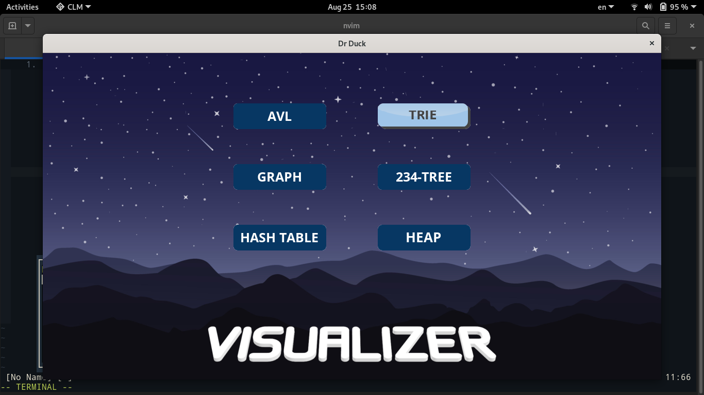
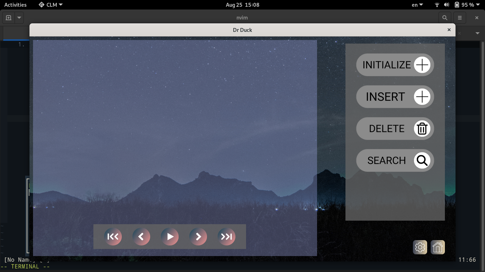
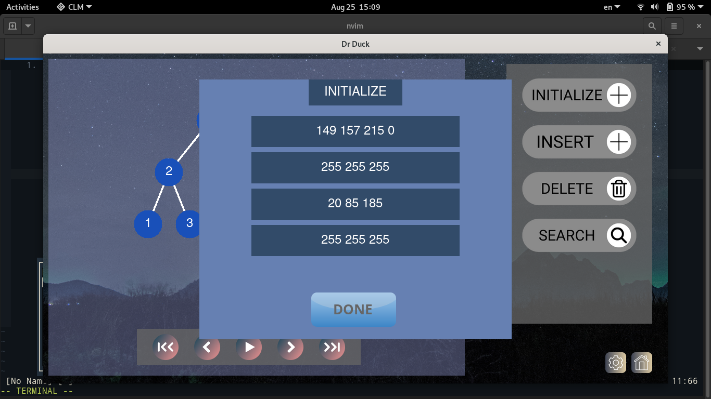
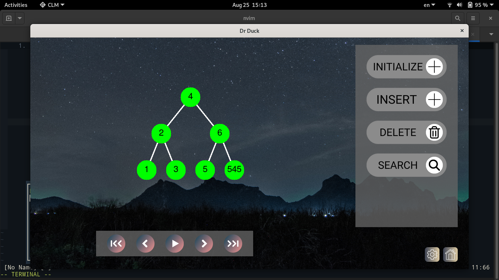

# VISUALIZER 
- This is my CS163 solo project that is used to visualize data structures.

## Dependency
- C++17
- SDL2 (SDL2_image, SDL2_ttf)
- https://github.com/nlohmann/json
- CMake
- Makefile
## Demonstrate

- Open the application 

- Choose one of those data structures, let example with AVL

- Init values 
![init][./sharing/image/inputinit.png]

- Press done to run
![run][./sharing/image/init.png]

- Press the gear in the bottom right of window

## Features

### Main features
- [x] Main menu
- [x] Option menu 
- [x] Settings
- [ ] Code highlight
    - [x] Hash table 
    - [x] AVL
    - [ ] 234 tree
    - [x] Heap 
    - [x] Trie
    - [ ] graph
### Data structures 
- [x] AVL 
    - [x] Initial, init from file
    - [x] Insert a value
    - [x] Delete a value 
    - [x] Find a value 
- [x] Trie 
    - [x] Initial, init from file
    - [x] Insert a value
    - [x] Delete a value 
    - [x] Find a value 
- [x] Hash table 
    - [x] Initial, init from file
    - [x] Insert a value
    - [x] Delete a value 
    - [x] Find a value 
- [x] Heap
    - [x] Initial, init from file
    - [x] Insert a value
    - [x] Remove the largest/smallest value
    - [x] Get the largest/smallest value 
    - [x] Get the size of heap 
- [x] Graph
    - [x] Init from matrix, file 
    - [x] Connected components 
    - [x] Minimum spanning tree
    - [x] Dijkstra
- [ ] 234 tree
    - [ ] Initial, init from file
    - [ ] Insert a value
    - [ ] Delete a value 
    - [ ] Find a value 
## Documentation
- [Report](./docs/latex/refman.pdf) 
- [Demonstrate video](https://youtube.com)
